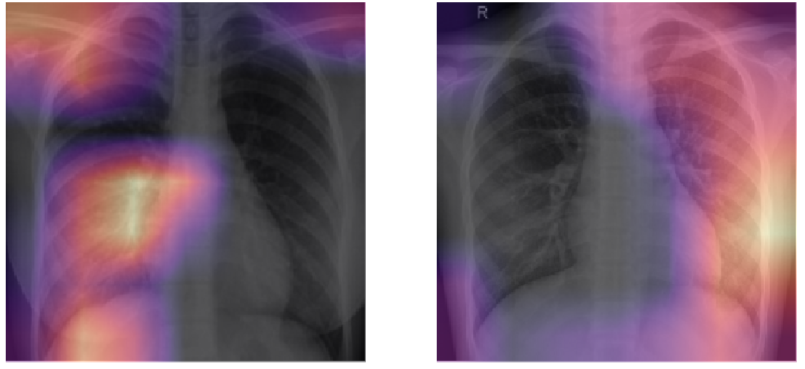

# COVID-19 DETECTION

**COVID-19 Detection using ResNet.**

**DATASET**

There are two different dataset made by collecting images from multiple resources.
The consolidated dataset contain appx. 1300 X-Ray images.
- Small Dataset - covid (contain appx 165 images)
- Large Dataset - chest-xray (appx. 1180 images) can be downloaded from [here](https://drive.google.com/open?id=1hxYElFxXaygH0p6rNpY2n2_2hIMThUIC)

**NOTEBOOKS**
- 1. Training Notebook - Data Exploration and Training is done in this notebook.
- 2. Inference Notebook - Inference is done in this notebook.

**REFRENCES**

- [ieee covid dataset](https://github.com/ieee8023/covid-chestxray-dataset)
- [Kaggle Pneumonia Dataset](https://www.kaggle.com/paultimothymooney/chest-xray-pneumonia)
